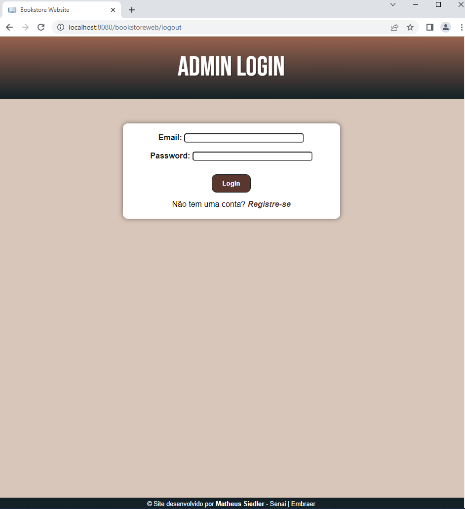
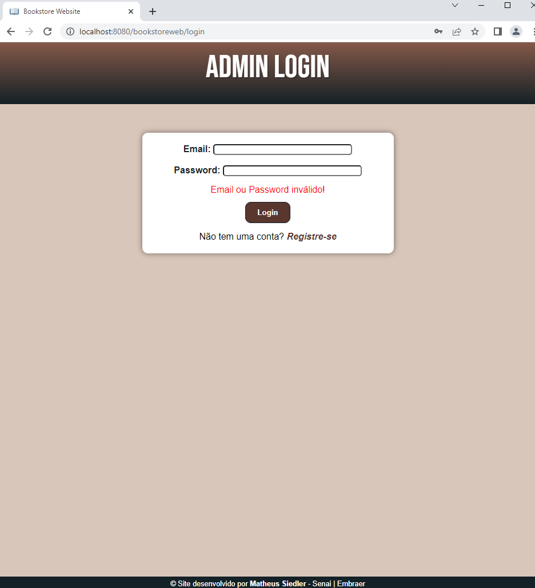
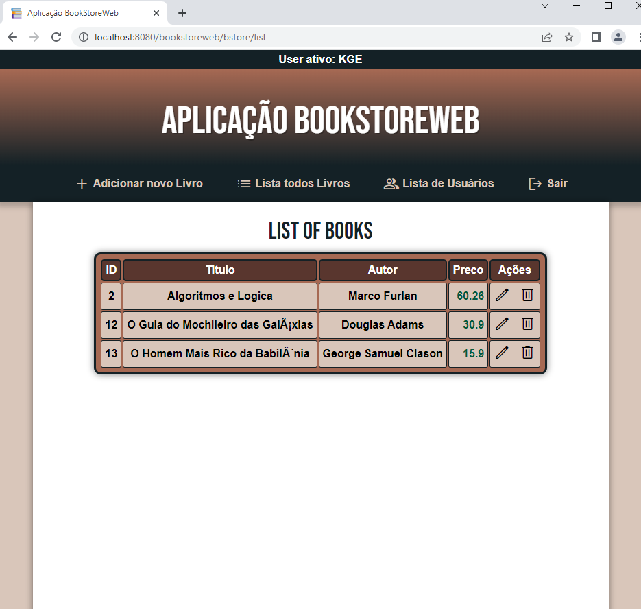
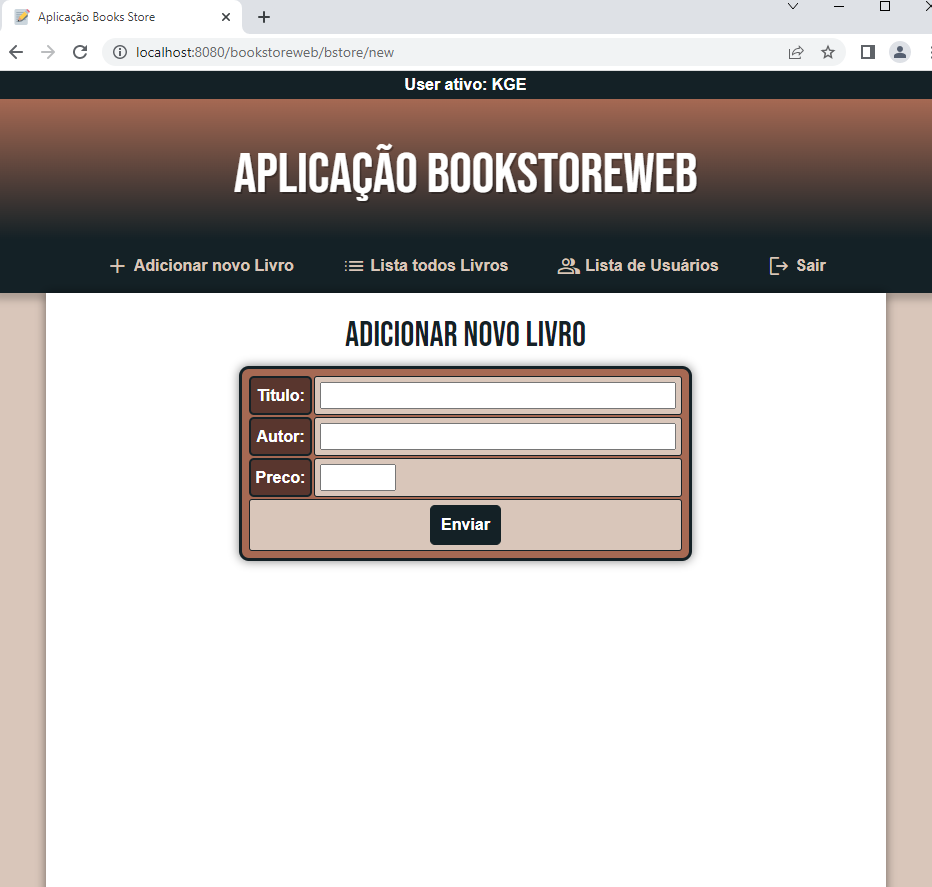
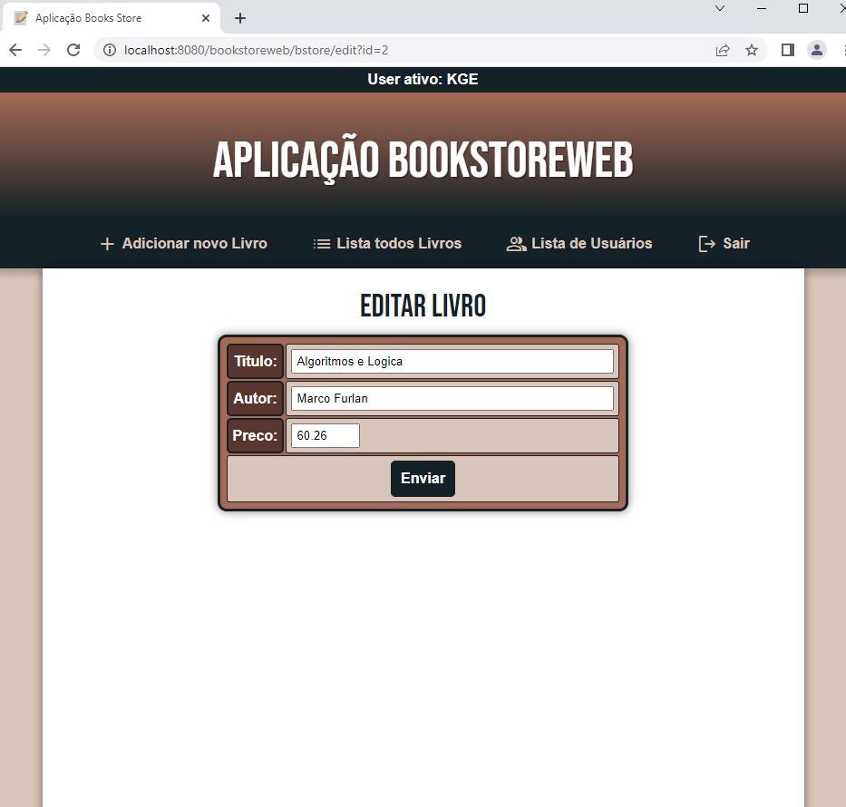
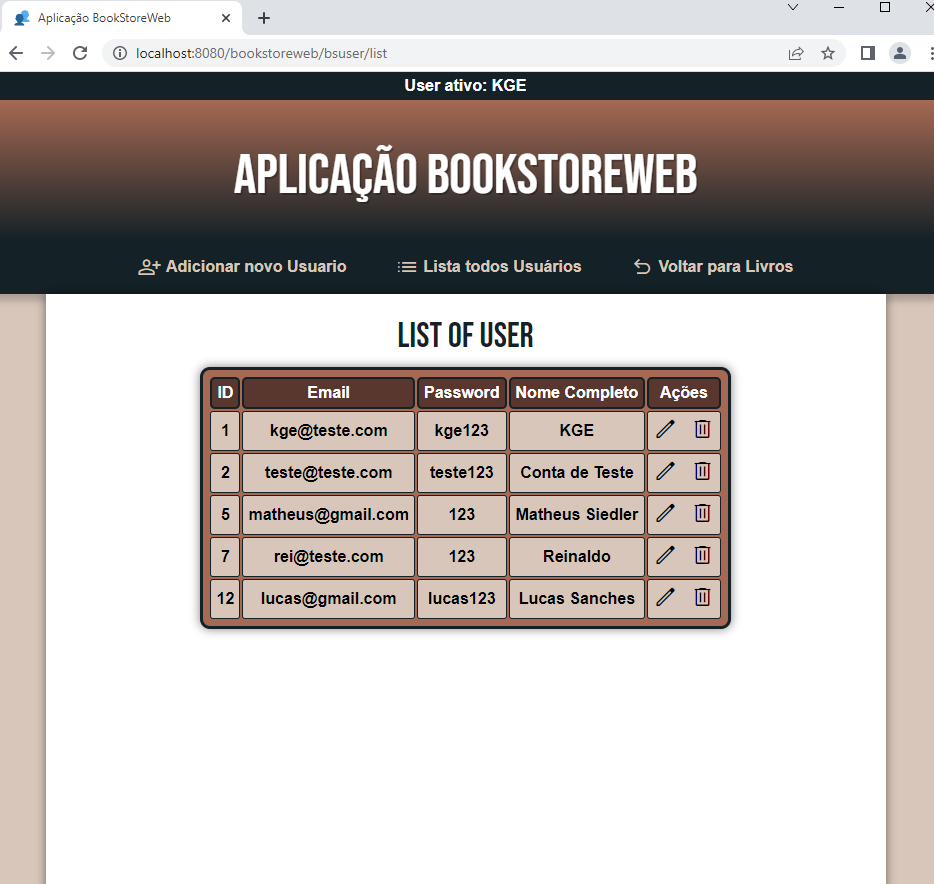
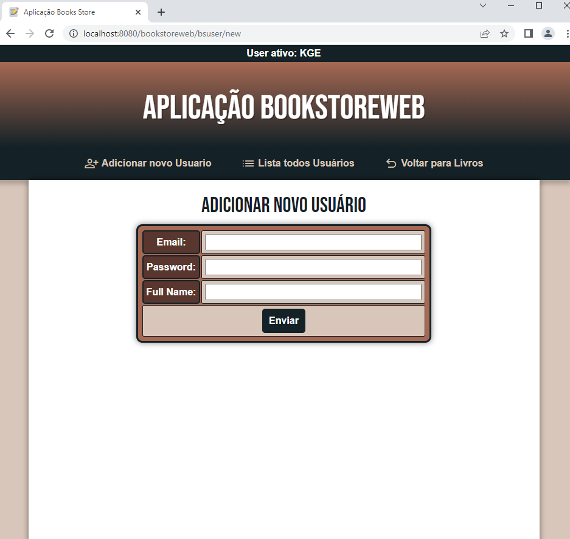
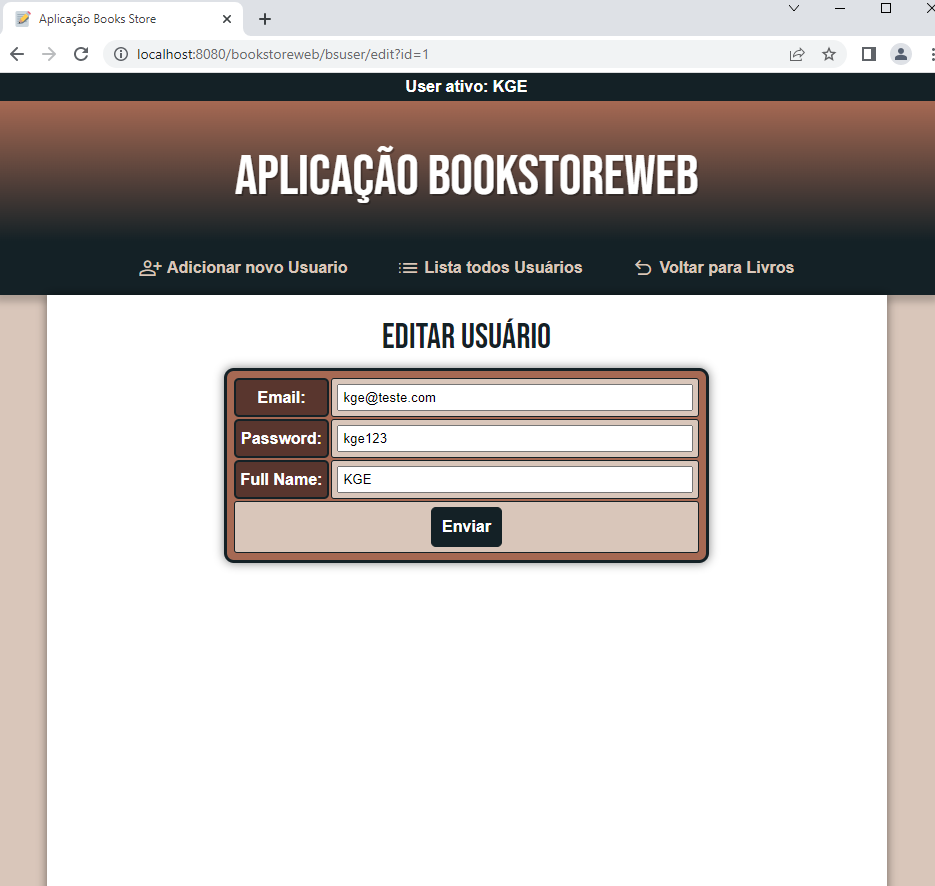

# 📚 BookStore Web App

Aplicação Web em Java simulando uma Loja de Livros online.

Nela, os conceitos de Filter, Session (Login e Logout), JSP (Jakarta Server Pages) e CRUD (Create, Read, Update e Delete) são aplicados.

## ⚙️ Funcionalidades

### Filter:
- <b>Filtro</b>, aplicado no acesso às páginas web do projeto, para autenticar o acesso de um usuário.

### Session:
- <b>Login</b>: inicia a sessão de um usuário.
- <b>Logout</b>: finaliza a sessão de um usuário.

### CRUD:
- Conjunto de métodos para adicionar, alterar ou deletar um registro no Banco de Dados.
- <b>Create</b>: insere um registro.
- <b>Read</b>: exibe os registros.
- <b>Update</b>: atualiza um resgistro.
- <b>Delete</b>: exclui um registro.

### 🌐 Telas do Projeto:

<ul>
  <li>Tela de Login:</li>
  
  <li>Tela de Login recusado:</li>
  
  <li>Tela da Lista de Livros:</li>
  
  <li>Tela do Formulário do Livro:</li>
  
  <li>Tela de Edição do Livro:</li>
  
  <li>Tela da Lista de Usuários:</li>
  
  <li>Tela do Formulário do Usuário:</li>
  
  <li>Tela de Edição do Livro:</li>
  
</ul>

## 🛠️ Feito Com:

## 🤝 Contribuição

Projeto aberto para ajuda!

### Support Ou Contato

Copyright © 2022 matheussiedler

